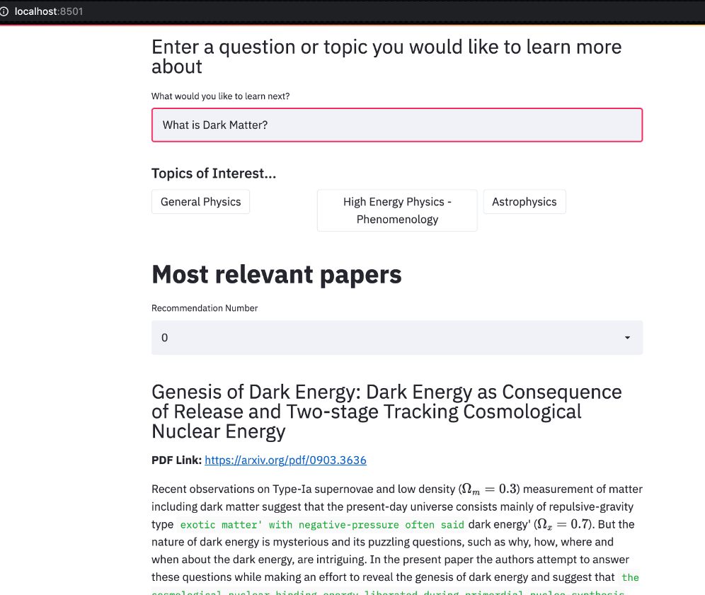

# STEM Paper Discovery App



### Install
- [NumPy](http://www.numpy.org/)
- [Pandas](http://pandas.pydata.org)
- [Transformers](https://huggingface.co/transformers/)
- [Streamlit](https://docs.streamlit.io/en/stable/)
- [Torch](https://pytorch.org/docs/stable/index.html)
- [Sentence_Transformers](https://www.sbert.net/)
- [SimpleTransformers](https://github.com/ThilinaRajapakse/simpletransformers)
- [scikit-learn](http://scikit-learn.org/stable/)

Run this command from shell to install all libraries

```bash
pip install -r requirements.txt
```

### Data
Data can be downloaded from [Kaggle](https://www.kaggle.com/Cornell-University/arxiv) here and must be placed in the data directory

- Can also be downloaded through Kaggle API by following these [instructions](https://github.com/Kaggle/kaggle-api)

```bash
pip install kaggle
kaggle datasets download -d Cornell-University/arxiv
unzip arxiv.zip
```
### Running App
- First make sure the full .json data file is saved in the data directory 
- Run generate_embeddings.py

```bash
python generate_embeddings.py --save 'y'
```

- Then you can run the app with the below code

```bash
streamlit run app.py
```
